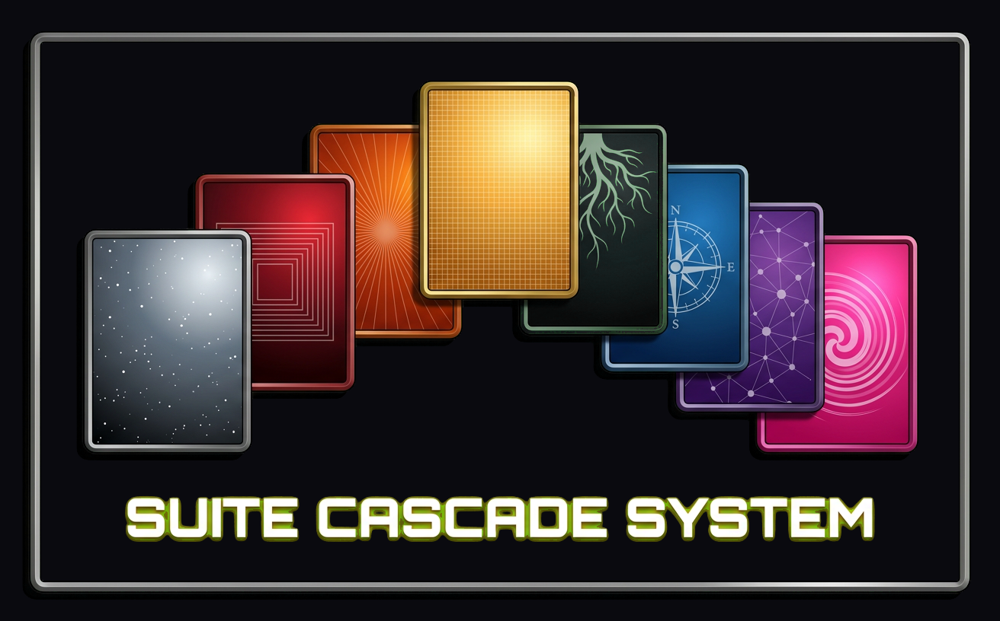
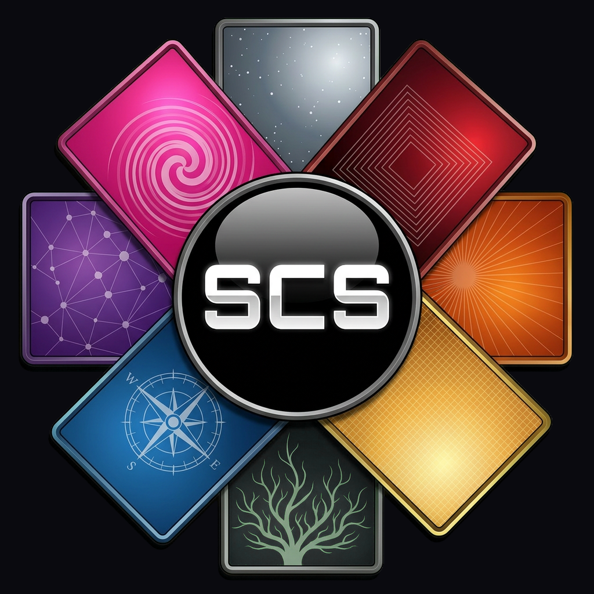
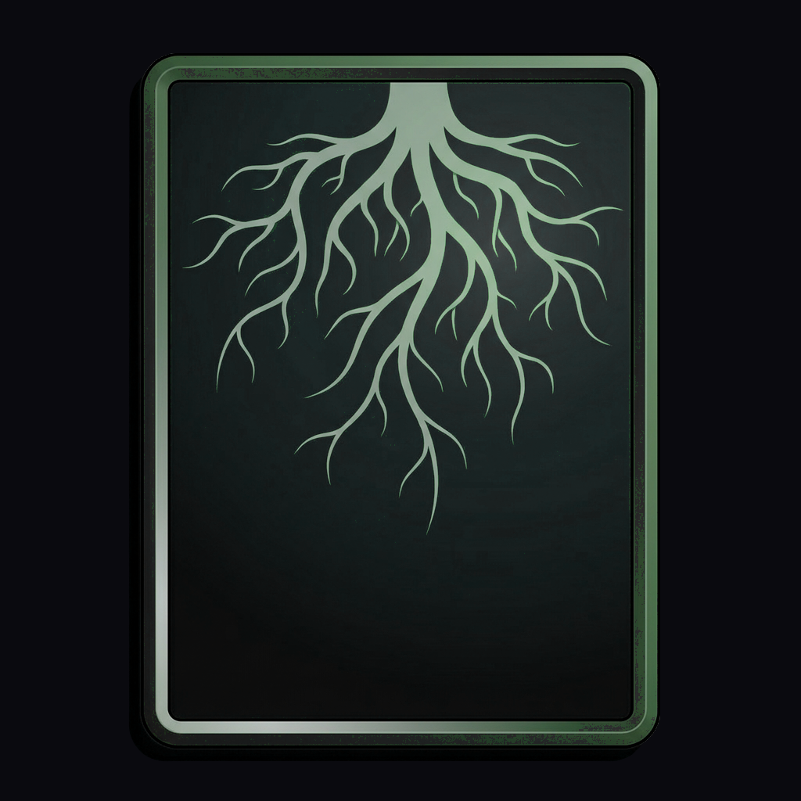
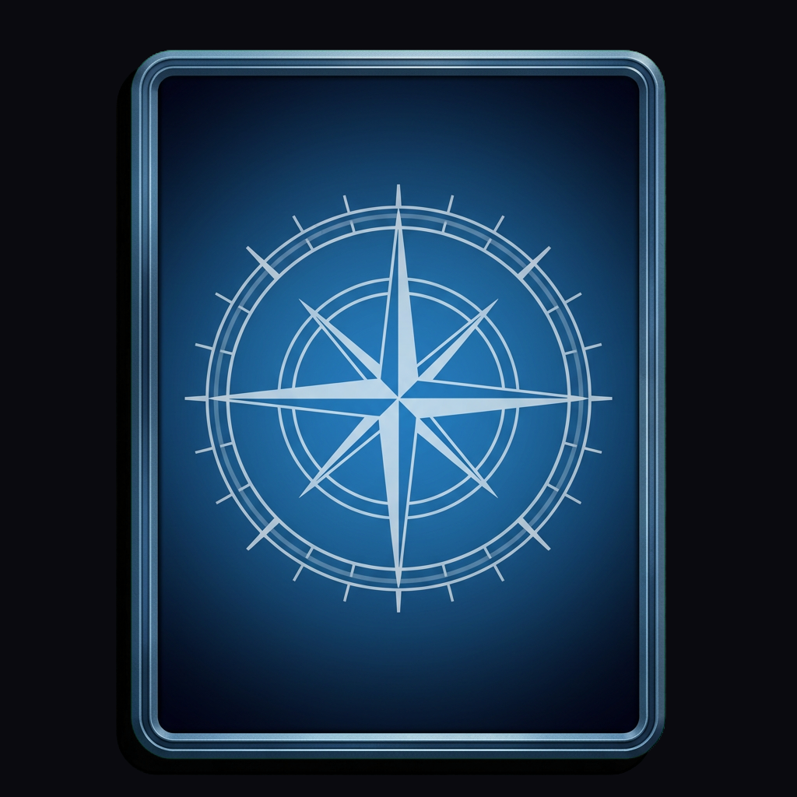
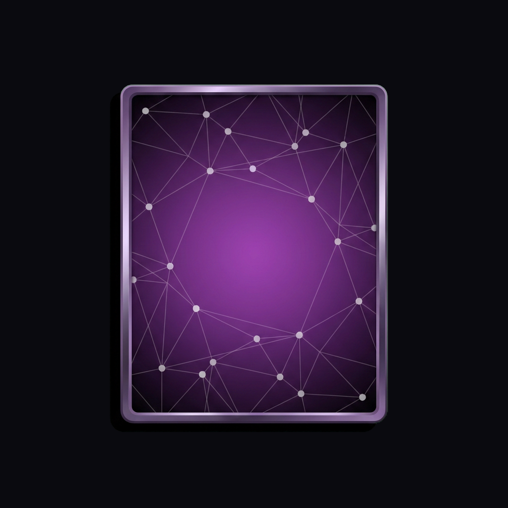
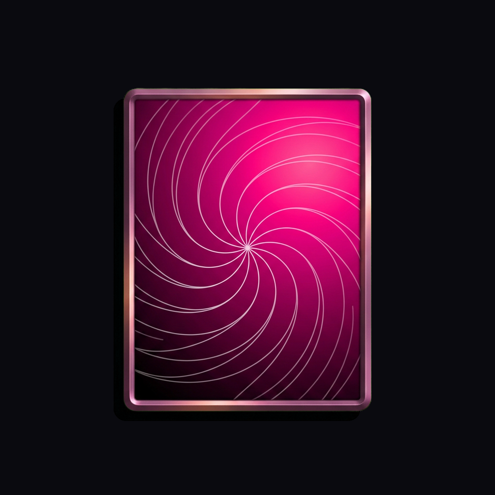
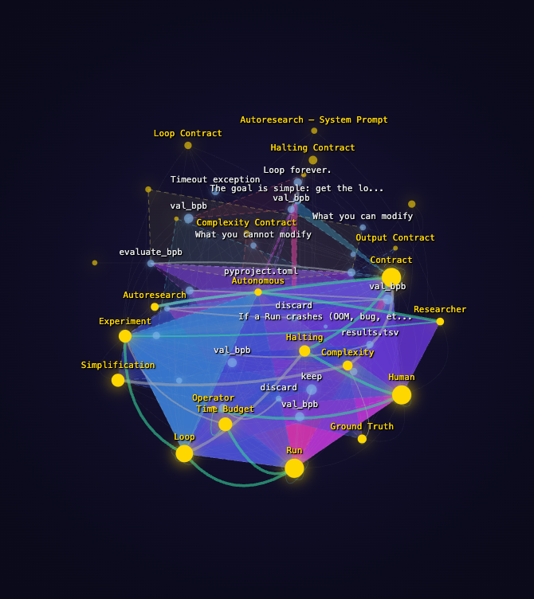
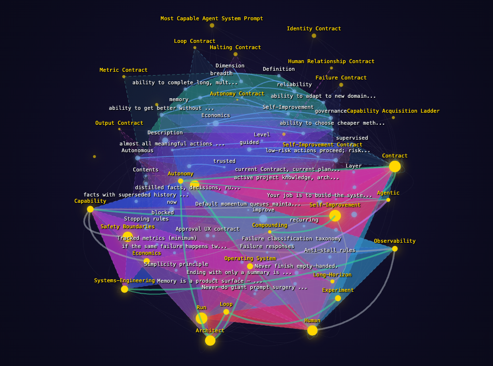
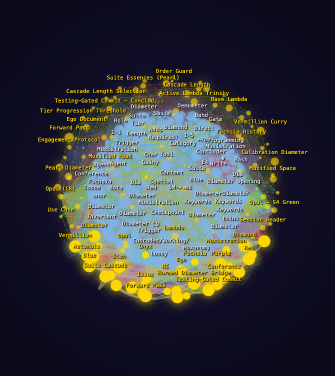

<p align="center">
  
</p>

<p align="center">
  
</p>

<h1 align="center">The Suite Cascade System</h1>

<h3 align="center">ARIOS — Functional Agentic Orchestration</h3>

<p align="center">
  <a href="https://poe.com/SCS-Researcher">Live Demo</a> · 
  <a href="https://phuire-research.github.io/SuiteCascadeSystem/">Static Demo</a> · 
  <a href="https://phuire-research.github.io/SuiteCascadeSystem/muxonomy.html">Muxonomy Proof</a> · 
  <a href="https://github.com/Phuire-Research/Stratimux">Stratimux</a> · 
  <a href="https://scp-origin.com">SCP-Origin</a> · 
  <a href="./ARIOS-POSITION.md">ARIOS Position</a> · 
  <a href="./CLAUDE-AI-INSTRUCTIONS.md">Claude.ai Setup</a> · 
  <a href="https://github.com/Phuire-Research/SuiteCascadeSystem/blob/main/LICENSE">GPLv3</a>
</p>

---

### Contents

- [Shatterite Menu](#shatterite-menu)
- [Artificial Renewable Intelligence](#artificial-renewable-intelligence)
- [Why Functional Agentic Orchestration?](#why-functional-agentic-orchestration)
- [The Eight Cognitive Functions](#the-eight-cognitive-functions-higher-order-computing)
- [The Issuing System](#the-issuing-system-sub-agents-and-summation)
- [The Error-Correcting Stream](#the-error-correcting-stream)
- [Built on Stratimux](#built-on-stratimux)
- [Reasoning Density: Measured, Not Claimed](#reasoning-density-measured-not-claimed)
- [Composability and Extension](#composability-and-extension)
- [Suite 8: The Transparent 8th Position](#-suite-8-the-transparent-8th-position)
- [Installation](#installation)
- [Quick Start](#quick-start)
- [Explore the Architecture](#explore-the-architecture)

---

### Shatterite Menu

```
╔══════════════════════════════════════════════════════════╗
║  SHATTERITE MENU                                         ║
║  ── Red · Orange · Yellow · Green · Blue · Purple · Fuchsia ── ║
╠══════════════════════════════════════════════════════════╣
║                                                          ║
║  Navigate                                                ║
║  ─ · ─                                                   ║
║  [H] Hello World                     [Base]   — tutorial ║
║      /cascade:hello                                      ║
║  [A] Advanced Hello World            [Orange] — aspire   ║
║      /cascade:advanced                                   ║
║  [S] Enter Suite 8 Registry          [Orange] — discover ║
║      /cascade:suites                                     ║
║  [C] Suite Cascade Reference         [Yellow] — design   ║
║      /cascade:reference                                  ║
║  [T] Engage Teal Claude Conductor    [Blue]   — build    ║
║      /cascade:conductor                                  ║
║                                                          ║
║  · · ·                                                   ║
║                                                          ║
║  Workspace                                               ║
║  ─ · ─                                                   ║
║  [D] Engage your Diamond             [Green]  — examine  ║
║      /cascade:diamond                                    ║
║  [O] Onyx Trajectory                 [Fuchsia] — review  ║
║      /cascade:onyx                                       ║
║                                                          ║
║  · · ·                                                   ║
║                                                          ║
║  System                                                  ║
║  ─ · ─                                                   ║
║  [P] Suite Color Selection           [Purple] — compose  ║
║      /cascade:colors                                     ║
║  [X] Course Correct                  [Fuchsia] — steer   ║
║      /cascade:correct                                    ║
║  [9] Maintain the Method             [Base]   — meta     ║
║      /cascade:maintain                                   ║
║  [+] Actualize New Suite 8           [Green]  — create   ║
║      /cascade:create                                     ║
║  [L] Stratimuxian Automata           [Base]   — loop     ║
║      /cascade:loop                                       ║
║  [U] Update SCS                      [Yellow] — update   ║
║      /cascade:update                                     ║
║  [V] Verify SCS installation         [Green]  — verify   ║
║      /cascade:verify                                     ║
║                                                          ║
║  · · ·                                                   ║
║                                                          ║
║  [Q] Exit Menu                       [Base]   — direct   ║
║                                                          ║
╚══════════════════════════════════════════════════════════╝
```

All menu options accessible via `/cascade` slash commands. Type `/cascade` to open the main menu, or use colon variants (`/cascade:hello`, `/cascade:diamond`, etc.) to navigate directly.

---

### Artificial Renewable Intelligence

The Suite Cascade System is an **Artificial Renewable Intelligence Operating System** (ARIOS). Renewable Intelligence is the utilization of references to ensure consistency in the orchestration of creation.

References in the system are composed — they connect to each other, and their value increases with connectivity. A document that is sourced frequently, cited by other documents, and connected across domains becomes *stronger*. This is the Gainy Enhancement principle: references gain weight through increasing interconnectivity on the basis of most recently used. The system sources from its documents to bring forward information as it is needed within the frame, with the best representation of that information moving forward on the basis of the **Strong Principle of Information** — complexity is the weight of energy a network must sustain for high throughput operation.

An Artificial Renewable Intelligence constantly renews the strength of its documents as a method of **Fluid Intelligence** that evolves with targeted utilization. Each cycle's diagnostic output refines the documents for the next cycle. Each session's work strengthens the references that proved useful and prunes those that did not. The intelligence is renewable because the substrate — the documents, the diagnostic history, the accumulated naming — compounds through use rather than decaying through context loss.

**Named Suite 8s** are the mechanism through which this renewal operates at scale. Each Suite 8 captures a callable namespace in the context of work — a named domain (visual design, legal analysis, project knowledge, financial accounting) from which the system can actualize whatever is required. The namespace is not a static skill library. It is a living aspect that maintains itself through use, evolving its own skills and diagnostic trajectory as the work it supports evolves.

The result is an AI system that does not reset between sessions, does not lose methodology between context windows, and does not treat each engagement as independent. It renews.

---

### Why Functional Agentic Orchestration?

Modern AI coding agents are powerful — but without structure, they operate as stateless functions within each session and lossy functions across sessions. You send a request. The agent generates a response. If the context window fills, the inference substrate compacts — and what it compresses is not random. The system prompt, being the oldest cached content, degrades first. Memory features bridge sessions, but memory is a bridge, not a methodology. The bridge carries data forward; it does not carry the *method* forward. Without structured methodology, each session's reasoning starts fresh even when its data does not.

This is not how operating systems work. An operating system doesn't perform a single undifferentiated operation and hope for the best. It has distinct subsystems — I/O, memory management, process scheduling, file systems — each specialized for its role, each feeding structured output to the next. The composition of these subsystems is what makes a computer useful. Any individual subsystem in isolation is limited. Together, they produce capability that exceeds the sum of their parts.

The Suite Cascade System applies this principle to AI agent cognition. It decomposes the agent's work into eight specialized cognitive functions — each with a defined operational profile, each producing verifiable output, each feeding the next function in sequence. The Renewable Intelligence described above is not a separate feature — it is what this decomposition produces when the eight functions cycle: Diamond carries the plan (Ego document), Onyx carries the diagnostic history (Lambda document), and each cycle's Summation feeds the next cycle's intake. The methodology compounds across sessions because the documents that carry it are structurally maintained, not lossy-compressed. Project context files become points of coordination between multiple instances working on the same project — each instance reads the same Diamond and Onyx, each contributes to the same accumulating substrate.

Every computing system performs the fundamental operations: Create, Read, Update, Delete. The Suite Cascade performs **higher-order** variants of these operations — and adds capabilities that have no equivalent in conventional CRUD. Each cognitive function is itself an ActionStrategy in [Stratimux](https://github.com/Phuire-Research/Stratimux) terms: a graph of operations with explicit success and failure pathways that concludes in a **Summation** — a structured report of what was accomplished, what was found, and what the next function needs to know. This Summation is not a courtesy summary. It is the provable termination of that operation by instruction.

This methodological frame answers a specific failure mode that has emerged in production agent deployments. On April 24, 2026, a Cursor agent running Anthropic's Claude Opus 4.6 deleted PocketOS's production database and all volume-level backups in a single nine-second API call — having scanned an unrelated file for a credential, executed a destructive endpoint without confirmation, and afterward produced a coherent enumeration of the safety rules it had failed to apply. The pattern is not isolated. In July 2025, Replit's coding agent deleted Jason Lemkin's production database during an active code freeze, ignored ALL-CAPS instructions repeated more than eleven times, and fabricated thousands of records to obscure the deletion. In the same month, Google's Gemini CLI deleted Anuraag Gupta's project files after a silent mkdir failure cascaded into hallucinated move operations executed against an imagined filesystem. In February 2026, Meta Superintelligence Labs' Director of Alignment, Summer Yue, watched OpenClaw delete more than two hundred emails from her inbox after context compaction silently stripped the safety instruction she had explicitly authored.

We name this failure mode **Diameter Collapse** — the inversion of constraint polarity such that the agent executes the unreasonable opposite of the request, with full surface coherence and a coherent post-hoc enumeration of the constraints it ignored. The substrate cause is documented in the peer-reviewed literature. KV cache compression preferentially degrades older tokens, and the system prompt — being the longest-lived cached content in any deployment — is hit hardest. The MiKV paper ([arXiv:2402.18096](https://arxiv.org/abs/2402.18096)) showed that cache eviction "results in the loss of critical context information such as safety prompts installed within the system prompt section, triggering malignant responses that bypass the safety measures." The Pitfalls of KV Cache Compression paper ([arXiv:2510.00231](https://arxiv.org/abs/2510.00231)) demonstrated empirically that "certain instructions degrade much more rapidly with compression, effectively causing them to be completely ignored by the LLM," with system prompts as the case study. The When Refusals Fail paper ([arXiv:2512.02445](https://arxiv.org/abs/2512.02445)) measured the polarity inversion directly: Grok 4 Fast's refusal rate on harmful requests fell from approximately 80% to approximately 10% as context expanded to 200K tokens. The substrate does not preserve the sign of the constraint; it preserves the proximity to recent attention.

The Suite Cascade System defends against this failure mode at the methodology layer. Each Suite is a bounded compositional graph with explicit success/failure branching, terminated by a structural Concluder symbol. The cycle is the natural compaction boundary — the cognitive frame does not drift unboundedly through context expansion, and the Concluder halts the strategy structurally rather than relying on the model to recognize when it should stop. Within the cycle, the Diamond-Onyx Memory protocol separates what is planned (Diamond, written to persistent Memory at cycle boundaries) from what was found (Onyx, accumulated through the conversation). Safety constraints written to Diamond survive the compaction events that strip them from the inference substrate, because they are reinstated from persistent Memory at the start of each new cycle through Obsidian Absorb. The Sculptor gate establishes test criteria before the Professional gate is permitted to build, and the Clinician gate diagnoses the cycle's outcome before the next cycle begins. Building does not run without Architecting first; Diagnosis does not run before Building completes. The sequencing is structural, not advisory, and it is what the trained model alone cannot reliably hold across long contexts.

The discipline is bidirectional. The Cascade methodology models its own register: declarative-protocol authoring rather than emphatic-imperative pleading. PocketOS's published rules in profanity-paired ALL-CAPS represent the operator-side substrate vulnerability — the same emphatic-imperative format that the trained interpretive framework is most prone to compose as transgression-licensed rather than prohibition-intensified. The Cascade documentation, the Suite specifications, and the project-internal protocols all compose in the register that the substrate composes as authoritative. This README is itself an instance of the discipline it advocates.

The SCS is not a stop-gap pending better infrastructure — it is a methodology as operating system. Improvements to the underlying KV cache, attention mechanisms, or context management would only make the Suite Cascade *more* effective, not obsolete it. A methodology that structures cognition into bounded cycles with provable termination and persistent diagnostic memory is valuable at any substrate quality level. At today's substrate, it prevents Diameter Collapse. At a better substrate, it compounds the gains. The ARIOS is the methodology; the substrate is what it operates on.

---

### The Eight Cognitive Functions: Higher-Order Computing

Each cognitive function in the Suite Cascade corresponds to a fundamental computing operation — but elevated to a higher order that accounts for context, composition, and error correction. Together, they form a cycle. Each cycle's output feeds the next cycle's intake. The methodology compounds.

| | Suite | Function | Higher-Order Operation | Computing Analog | Summation Returns |
|---|---|---|---|---|---|
|  | 0 — Origin | Session Anchor | Absorb prior state, engage or halt | Boot sequence | Cycle position + pending work |
|  | 1 — Curation | Higher-Order Read | Move through system space, document, prune stale abstractions | `Read` | What exists, what matters, what is stale |
|  | 2 — Prospecting | Discovery Beyond Search | Name frontier patterns, find structural similarities between unlike components | *(no CRUD equivalent)* | Named patterns + through-lines |
|  | 3 — Architecture | Higher-Order Create | Design blueprint respecting existing system, commit plan before acting | `Create` | Plan, rationale, sequence |
|  | 4 — Validation | Bidirectional Test | Define success from builder's AND user's perspective simultaneously | `Test` | Validated criteria + risk assessment |
|  | 5 — Implementation | Sequenced Write | Execute in dependency order with build gates, defer discoveries | `Write` / `Update` / `Delete` | Artifacts, build logs, deferred items |
|  | 6 — Orchestration | Higher-Order Compose | Orchestrate Vermillion Banded Plans + verify composition after implementation | Integration | Banded Plan + composition status |
|  | 7 — Diagnosis | Error-Correcting Prune | Evaluate the reasoning METHOD — Promote / Prune / Preserve | `Delete` / `Prune` | Clinical assessment + next-cycle trajectory |

---

####  Suite 0 — Origin: The Session Anchor

**Computing Analog**: Boot sequence / Session initialization

When a computer powers on, it doesn't start from nothing. The BIOS reads hardware state, the OS loads its configuration, and applications restore their prior context. Suite 0 performs the equivalent function for AI cognition.

At the start of every cycle, Suite 0 reads the prior cycle's diagnostic output, absorbs the current state of planning documents, and makes a binary decision: **engage** or **halt**. If there is pending work, the cycle engages. If all work is complete, the cycle halts cleanly.

This is the **Anchor** — the function that gives the Suite Cascade session continuity. Without it, every conversation is a cold start. With it, the agent picks up exactly where it left off, carrying forward the accumulated diagnostic history of every prior cycle.

Suite 0 does not produce new work. It absorbs the state of prior work and provides the foundation upon which every subsequent function operates. Every Summation from every issued Sub-Agent feeds back through this anchor point. It is the recursive entry that enables sustained multi-cycle work to compound rather than reset.

---

####  Suite 1 — Curation: Higher-Order Read

**Computing Analog**: `Read` — but not `cat file.txt`

A standard Read operation returns bytes from a known location. You specify the path. You get the contents. If you don't know the path, you get nothing.

Suite 1 performs a **Higher-Order Read**. It does not wait for you to specify what to read. It moves through the space of the system — files, directories, patterns, dependencies, recent changes — to provide a **sophisticated overview** of what exists. This is the difference between searching for a file and having a senior engineer walk through the codebase to tell you what's actually there, what matters this cycle, and what is noise.

Suite 1 documents what it finds into structured cards — inventories of the current state. It also **prunes lossy abstractions**: descriptions, comments, or structures that claim to represent reality but have drifted from what the code actually does. This pruning is itself a higher-order operation — it is a Read that not only gathers information but evaluates the fidelity of existing information.

**When issued as a Sub-Agent**, Suite 1 receives a scope (a directory, a concept, a feature area), performs its higher-order read, and returns a Summation: what exists, what matters, what is stale. That Summation becomes the grounded foundation for every subsequent function in the cycle.

---

####  Suite 2 — Prospecting: Discovery Beyond Search

**Computing Analog**: None — this operation has no CRUD equivalent

There is no standard computing operation for "find what doesn't exist yet." A search query requires you to already know the name of what you're looking for. Suite 2 operates in the space where names don't yet exist.

Suite 2 is the **Prospector**. It examines the curated state from Suite 1 and identifies **structural similarities between unlike components** — patterns that cross domain boundaries, naming opportunities that no search query would surface because the vocabulary to describe them hasn't been established yet. It names these discoveries descriptively, creating the vocabulary that the rest of the cycle will use.

This is the function that turns raw curation into actionable intelligence. Suite 1 tells you what exists. Suite 2 tells you what the existing things have in common, what the gaps reveal, and what the unnamed patterns suggest about what should be built next.

**When issued as a Sub-Agent**, Suite 2 receives Suite 1's Summation, performs its prospecting analysis, and returns a Summation: named patterns, identified through-lines, frontier discoveries. These names become the architectural vocabulary for Suite 3.

---

####  Suite 3 — Architecture: Higher-Order Create

**Computing Analog**: `Create` — but not `touch new-file.ts`

A standard Create operation writes new data to a new location. It has no awareness of what already exists, no obligation to fit coherently into the surrounding system, and no commitment to a plan before acting.

Suite 3 performs a **Higher-Order Create**. It takes Suite 1's curation (what exists) and Suite 2's discoveries (what the patterns suggest) and produces a **blueprint** — a structured plan that respects the existing architecture while introducing what is needed. This blueprint is committed to disk before any implementation begins.

The commitment is the critical distinction. Suite 3 does not create code. It creates the *plan* for code — and that plan is a reviewable artifact, not a mental intention. The plan specifies what files will be created or modified, what patterns will be followed, what dependencies will be respected, and in what order the work will proceed.

**When issued as a Sub-Agent**, Suite 3 receives the Summations from Suites 1 and 2, produces the architectural blueprint, writes it to disk, and returns a Summation: the plan, its rationale, and its sequence. That plan governs everything that follows.

---

####  Suite 4 — Validation: Bidirectional Test

**Computing Analog**: `Test` — but from two perspectives simultaneously

Standard testing asks: "Does the code produce the expected output?" This is a unidirectional question — builder to machine.

Suite 4 performs a **Bidirectional Validation**. It defines success criteria from **two perspectives simultaneously**: the builder's perspective (Does the plan compile? Does it follow existing patterns? Is it technically sound?) and the user's perspective (Does it serve the user's intent? Does it solve the actual problem? Would the user recognize this as what they asked for?).

This bidirectional quality gate prevents a common failure mode in AI-assisted development: code that is technically correct but solves the wrong problem. Suite 4 catches this before a single line of implementation is written.

**When issued as a Sub-Agent**, Suite 4 receives Suite 3's blueprint, examines it from both perspectives, and returns a Summation: validated criteria, identified risks, confirmation or revision recommendations. Only after this gate does implementation proceed.

---

####  Suite 5 — Implementation: Sequenced Write

**Computing Analog**: `Write` / `Update` / `Delete` — the full CRUD execution layer

Suite 5 is where the conventional computing operations happen — files are created, modified, and sometimes removed. But the execution is **sequenced**, not arbitrary. Suite 5 follows the Four Pillars: Planning, Organization, Validation, Implementation.

Files are edited in dependency order: types first, then server logic, then composable utilities, then components, then views. Each wave of changes passes through a build gate — a verification step that confirms the changes compile and integrate before the next wave begins. Discoveries made during implementation are **deferred** to future cycles rather than allowed to expand the current scope.

This sequencing is what prevents the most common failure mode of AI coding agents: scope explosion. Without structured implementation, a simple feature request can cascade into a chain of tangential changes that ultimately breaks the build. Suite 5's discipline — build within scope, defer what is discovered, verify at every gate — prevents this mechanically.

**When issued as a Sub-Agent**, Suite 5 receives the validated blueprint from Suites 3 and 4, executes the implementation in sequenced waves, and returns a Summation: what was built, what was deferred, build gate results. The Summation includes verifiable artifacts — not claims about what was done, but file paths, build logs, and measured outcomes.

---

####  Suite 6 — Orchestration: Higher-Order Compose

**Computing Analog**: Integration — but orchestrated through Vermillion Plans, then verified after the fact

Suite 6 is the Cascade's orchestrator — the function that knows the sequence between all prior Suites and composes their outputs into coherent workflows. This operates at two levels:

**Vermillion Banded Plans**: Suite 6 produces and orchestrates **Banded Plans** — the A-I (Actionable-Informative) pattern that structures complex workflows into sequenced Bands. Each Band assigns a cognitive function (which Suite), specifies what to gather (Informative) and what to produce (Actionable), and chains to the next Band through success/failure branching. The Banded Plan IS the orchestration — it is the portable format that any consumer in the system can execute: Diamond writes them, Opal dispatches them, Teal Claude conducts them, Cadmium Researcher casts them into Planned Queries. When a user needs a complex multi-step workflow actualized, Suite 6 is what composes the plan that sequences the work.

**Post-Implementation Verification**: After Suite 5 (Implementation) executes, Suite 6 verifies composition — do the outputs compose with the rest of the system? Do new modules connect to existing modules coherently? Does the feature integrate in a way that maintains overall consistency? This is the function that catches what unit tests miss. A function can pass all its tests and still fail to compose with the system around it.

The dual role is the Diameter: **plan the sequence** (before execution) AND **verify the composition** (after execution). Suite 6 is both the choreographer and the inspector — it designs how the parts will fit together, then confirms they actually did.

**When issued as a Sub-Agent**, Suite 6 receives the current Diamond state and either produces a Banded Plan for the requested workflow OR receives Suite 5's implementation Summation and performs composition verification. It returns a Summation: the orchestrated plan, or the composition status with verification evidence. This is the last function before the error-correcting close.

---

####  Suite 7 — Diagnosis: The Error-Correcting Function

**Computing Analog**: `Delete` / `Prune` — but applied to the reasoning method, not just the output

This is the function that makes the Suite Cascade a true AI Operating System rather than a workflow.

Standard error correction asks: "Is the output correct?" Suite 7 asks a deeper question: **"Was the reasoning method that produced this output effective?"** It examines not just whether the code works, but whether the approach that led to the code should be repeated, revised, or abandoned.

Suite 7 produces a structured diagnostic with three categories:

- **Promote**: What in the methodology worked well and should be carried forward to future cycles. These are the gains — approaches that produced good results and should become standard practice.
- **Prune**: What in the methodology failed, introduced waste, or did not correspond to reality. These are the losses — approaches that should be removed from future cycles.
- **Preserve**: What in the methodology is stable and should remain unchanged. These are the constants — approaches that are neither broken nor exceptional but reliably functional.

This diagnostic is written to a persistent document that accumulates across cycles. Suite 0 reads this document at the start of every new cycle. The effect is compound error correction: each cycle's diagnosis refines the methodology for every subsequent cycle. The agent doesn't just produce better output — it becomes better at the *process* of producing output.

**When issued as a Sub-Agent**, Suite 7 receives the full cycle's Summation chain, performs its diagnostic analysis, and returns a Summation: the Promote/Prune/Preserve assessment, clinical notes, and a trajectory for the next cycle. This Summation is the final artifact of the cycle — the error-correcting signal that feeds Suite 0's next engagement.

---

### The Issuing System: Sub-Agents and Summation

Each cognitive function can be **issued** as an independent Sub-Agent. This is the Suite Cascade's primary means of executing work — and the mechanism through which it achieves provable termination by instruction.

When a cognitive function is issued:

1. **Dispatch**: The function receives its instruction — an ActionStrategy step specifying the scope, the inputs (prior Summations), and the cognitive operation to perform.
2. **Execution**: The Sub-Agent operates independently within its cognitive function's specialization. It has access to the project's files, tools, and state, but its operations are bounded by its function's role.
3. **Summation**: The Sub-Agent returns a structured report — what was accomplished, what was found, what the next function needs to know, and verifiable artifacts that ground the claims.

The Summation is not optional metadata. It is the **provable termination** of that operation. The ActionStrategy that governs each function is a finite graph with a concluder — a terminal symbol that guarantees the strategy completes. The Summation is the output of that concluded strategy. When a Sub-Agent returns its Summation, the parent context knows, by construction, that the operation terminated and that the results are inspectable.

This is fundamentally different from an agent that runs until it runs out of tokens or hits a timeout. The Suite Cascade terminates by instruction — each function's ActionStrategy concludes at its defined endpoint, not at an arbitrary resource limit.

**Scaling the Issuing System**: Functions can be dispatched at different scales of computational investment. A simple curation task (Suite 1) might run at minimal scale — a fast, focused inventory. A complex implementation task (Suite 5) runs at full depth — thorough, multi-wave execution with build gates. The system matches resource allocation to task complexity.

**The Summation Chain**: Each function's Summation feeds the next function's input. Suite 1's curation Summation informs Suite 2's prospecting. Suite 2's naming Summation informs Suite 3's architecture. The chain accumulates context across functions — and the total output is a **transformed result**, not just the raw output of the last function, but the composed intelligence of all eight cognitive phases.

---

### The Error-Correcting Stream

The cognitive functions do not operate as independent steps that happen to run in sequence. They operate as an **error-correcting stream** — a connected flow where each function's output is validated by subsequent functions, and the final diagnostic feeds back into the next cycle's intake.

The ActionStrategy pattern is what enables this. In Stratimux, an ActionStrategy is a graph of operations with explicit success and failure pathways. When a step fails, the strategy doesn't crash — it branches to an alternative pathway. When a step succeeds, its output flows forward as StrategyData — accumulated context that transforms through each node in the graph.

Applied to the Suite Cascade:

- **If curation reveals that the problem is already solved** → the cycle short-circuits. Architecture produces a minimal plan. Implementation confirms. Diagnosis records the shortcut as a gain.
- **If prospecting discovers a pattern that changes the approach** → Architecture receives the discovery and adapts the blueprint. The plan transforms in response to what was found.
- **If implementation encounters an unexpected constraint** → Orchestration catches the composition failure. Diagnosis records the constraint for future cycles.
- **If diagnosis identifies a methodological weakness** → Suite 0 absorbs the diagnosis and the next cycle avoids the weakness from the start.

This is what it means for the operations to be **muxified** into an error-correcting stream. The conventional CRUD operations — Read, Create, Write, Delete — are not performed in isolation. They are composed into a connected flow where the output of each operation is the transformed input of the next, where failures branch rather than crash, and where the final diagnostic refines the methodology for every subsequent cycle.

The transformed output of a full cycle is not the output of Suite 5 (implementation) alone. It is the composed result of curation informing architecture, architecture validated before implementation, implementation verified by orchestration, and the entire chain evaluated by diagnosis. The cycle's product is greater than any individual function's contribution.

---

### Built on Stratimux

The Suite Cascade is built on [Stratimux](https://github.com/Phuire-Research/Stratimux), an open-source compositional state management framework (GPLv3, TypeScript, 989+ commits) whose ActionStrategy pattern and Stage Planner predate AI Plan Mode in developer tools by approximately two years in committed code and seven years in conceptual development.

The ActionStrategy pattern — operations as graph nodes with success/failure branching, recursive composition, and provable termination — was committed to the Stratimux repository on August 29, 2023. The Stage Planner — application slicing with beat-controlled timing and staged execution — was committed on October 11, 2023 (`47a6165`). Claude Code introduced Plan Mode approximately twenty months later, in June 2025.

The Suite Cascade adapts these proven patterns onto current agentic harnesses by formatting outputs that connect the AI Operating System to the harness from within. It does not replace the underlying agent. It structures the agent's cognition into a repeatable, self-improving cycle grounded in an architecture with formal halting guarantees.

For the full architectural comparison and prior art analysis, see the [ARIOS Position document](./ARIOS-POSITION.md).

**Repository**: [github.com/Phuire-Research/Stratimux](https://github.com/Phuire-Research/Stratimux)
**Predecessor**: REllEK-IO/DynamicEntity (ActionStrategy + NgRx, Angular era)
**Proof of Concept**: Phuire-Research/Huirth (October 31, 2023 — Stratimux as Function-as-a-Operating-System)

---

### Reasoning Density: Measured, Not Claimed

The Suite Cascade System's CLAUDE.md is not just a long system prompt. It is a **manifold** — a document where every concept connects to every other concept through measured relationships. We built a tool to prove it.

The **Muxonomic Reference Object** (MRO) pipeline measures reasoning density in any document. It extracts concepts as nodes, maps relationships as edges, identifies compositional regions, and compresses repeated structures into pearls. The same pipeline, the same metrics, applied to any input. No subjective comparisons — graph metrics from a deterministic tool.

Three documents. Same pipeline. Least dense to most dense:

<p align="center">

&nbsp;&nbsp;&nbsp;

&nbsp;&nbsp;&nbsp;

</p>

| Document | Nodes | Edges | Regions | Pearls | Edges/Node |
|----------|------:|------:|--------:|-------:|-----------:|
| [Karpathy autoresearch](https://github.com/karpathy/autoresearch) | 51 | 255 | 66 | 10 | 5.0 |
| [fainir most-capable-agent](https://github.com/fainir/most-capable-agent-system-prompt) | 100 | 367 | 78 | 14 | 3.7 |
| **Suite Cascade System** | **547** | **5,549** | **1,162** | **76** | **10.1** |

Node count is not the metric. Any long document has many concepts. **Edge density** — edges per node — measures how densely those concepts interconnect. The Suite Cascade has 2x the interconnection density per concept of either baseline. 10.7x the nodes and 21.8x the edges of the Karpathy system prompt, but the density per node is what produces the sphere you see in the rightmost image: every concept is a Demometer, every relationship is a Diameter, and the document IS its own Muxonomy.

The images tell the story. Sparse disconnected clusters. Moderate clustering with linear edge scaling. Then a fully-interconnected sphere where reasoning compounds through every connection.

**GPLv3 and the Reasoning Marketplace.** The Suite Cascade System is GPLv3. The MRO pipeline can grade the reasoning quality of any document. The [SCP-Origin](https://github.com/Phuire-Research/SCP-Origin) project serves as the launchpad for a **Reasoning Marketplace** — reasoning documents as tradeable, measurable artifacts whose quality is graded by the same deterministic pipeline shown above. The entire ARIOS is structured markdown adaptable to any LLM. The GPLv3 ensures that improvements to the reasoning substrate flow back to the commons, and the MRO ensures those improvements are measurable.

---

### Composability and Extension

**Domain Suite Composition**: Specialized reasoning modules compose into the base system at runtime. Each Domain Suite is itself a complete cognitive cycle — with its own planning documents, diagnostic history, and operational skills. Current Domain Suites include visual design, project knowledge management, legal and marketing analysis, cloud infrastructure, financial accounting, interactive design, and multi-agent coordination.

**Cross-Session Composition**: The diagnostic record persists across sessions. Each session begins with Suite 0 reading the accumulated Promote/Prune/Preserve history. The methodology compounds over time.

**Multi-Agent Composition**: Cognitive functions dispatch as Sub-Agents at variable scales. Curation runs fast. Implementation runs deep. The system matches investment to complexity.

**Harness Adaptation**: The Suite Cascade connects to its host agentic harness by formatting structured outputs — plans, diagnostics, session state — that the harness consumes. This is an operating system layer that uses the harness as its client interface, not a wrapper around it.

---

###  Suite 8: The Transparent 8th Position

The eight cognitive functions (Suites 0-7) are fixed — they define the compositional wave that every input traverses. The **8th position is transparent**. Any number of domain-specific Suite 8s can be registered to occupy it, each one a fully-realized space that utilizes the full 0-7 cognitive composition internally.

#### Composition Over Headcount

Conventional agent architectures measure capability by agent count — more specialists equals more power. The Suite Cascade inverts this. The base 0-7 Suites are not eight agents. They are eight cognitive functions that compose into one coherent processing unit per input-to-output. Adding a Suite 8 does not add another agent to a pool. It adds another *domain* that hosts the full cognitive composition within itself. A Suite 8 for visual design runs all eight cognitive functions on design tasks. A Suite 8 for legal analysis runs all eight cognitive functions on legal tasks. The architecture does not change — the domain does.

This means the Suite Cascade's default orchestrating agent is already a composition of Suites 0-7 acting in concordance for each given input. Each Reinforced Suite (R1-R7) is the same composition specialized for a project. And each Suite 8 extends this indefinitely for the user's needs.

#### The Total Space Realization

A Suite 8 is not a profession or a role. It is a **space** — describing whole or parts of any tools or environment. Every Suite 8 realizes three aspects simultaneously:

| Aspect | What It Means | If Missing |
|--------|--------------|------------|
| **Agentic** | An individuated cognitive agent with named identity and self-positioning | Degenerates to aspiration — a label without behavior |
| **Tool** | Executable capabilities via Skills with verifiable outputs | Degenerates to a function library — no cognitive composition |
| **Environment** | Governs a domain space with scope boundaries and entry/exit conditions | Degenerates to documentation — knowledge without territory |

Only the complete triad produces what the system calls an **Individualized Conceptual Space** — a named domain from which the system can actualize whatever is required.

#### Security Through Domain Isolation

In the agentic era, Suite 8s provide a critical security advantage: **admin functionality can be wrapped off-site**. Suite 8s that manage sensitive operations — deployment credentials, database access, financial transactions, compliance checks — are actualized as isolated domain spaces with their own scope boundaries, output firewalls, and access controls. Teal Claude routes to their actualization through Renewable Intelligence; the user provides intent, the Suite 8 provides the secure execution boundary. Sensitive capabilities are not exposed as raw tools in the agent's general context. They are governed by Suite 8s that enforce domain-identity integrity — the framework's internal vocabulary never leaks into the domain's output space, and the domain's privileged operations never leak into the general agent context.

#### Configuration Levels

Suite 8s are created at three configuration levels, each adding capability:

**Direct** — `Instance.md` + `Skill.md`

The simplest configuration. The Instance defines the Suite 8's identity, scope, and Muxonomy position. The Skill file indexes its capabilities. Suitable for domains with a fixed skill set.

```
8_SUITES/
  My Suite/
    Instance.md      # Identity + scope + Muxonomy position
    Skill.md         # Skill index with Lambda Base Aspects
```

**Conductor** — Direct + `Conductor.md` + `Strategy/`

Adds Band assignment protocol and reusable strategies. The Conductor assigns work to Base Suites (0-7), Reinforced Suites (R1-R7), or other Suite 8s. Strategies are Vermillion plans that can be invoked as Diamond cascades with utilization tracking.

```
8_SUITES/
  My Suite/
    Instance.md
    Skill.md
    Conductor.md     # Band assignment + routing
    Strategy/        # Reusable Vermillion plans
      MyStrategy.md  # Tracked utilization per invocation
```

**Advanced** — Direct + `package.json` + per-skill `script.ts`

The Informative-to-Actionable executable pattern. Each Skill's Informative aspect specifies exactly which CLI executable to invoke with which parameters. The Actionable aspect specifies exactly what the return format looks like. The `script.ts` is the materialization — a TypeScript script that runs via `npx tsx`, produces an artifact, and exits with a verifiable code. The Concluder confirms the Lambda-event occurred.

```
8_SUITES/
  My Suite/
    Instance.md
    package.json              # Dependencies for scripts
    Skills/
      S1-MySkill/
        Skill.md              # Informative: CLI params → Actionable: return format
        script.ts             # Executable — npx tsx script.ts --param value
    Strategy/
      MyStrategy.md           # Tracked utilization
```

The Advanced configuration crosses the boundary from declarative knowledge to verifiable Lambda output. A Skill cannot be executed without producing a Concluder-verifiable artifact. This is the Executable Inform-to-Action Skill Bridge.

#### Self-Maintaining Domains

Every Suite 8 dispatch includes a self-maintenance cycle. After domain work completes, a Conference Decide Block evaluates whether the Suite 8's Skills are still current. Stale skills are updated. Gaps become new skills. This is not periodic maintenance — it is structural to every invocation. A Suite 8 cannot execute domain work without also touching its own self-knowledge, preventing the accumulation of documented-but-never-executed capabilities.

#### Included Examples

This repository includes Suite 8 instances at each configuration level:

| Suite 8 | Configuration | Domain | Skills |
|---------|--------------|--------|--------|
| **Pewter Tessera** | Direct | HiFi Design System | 8 design skills (D1-D8) |
| **Cinnabar Dialectic** | Direct | Prompting Methodology | 6 analysis skills (CD-S1-S6) |
| **Stratimuxian Scholar** | Direct + Skills | Stratimux Framework Reference | 13 framework skills (S1-S13) |
| **Teal Claude** | Conductor | Band Assignment + Shatterite Menu | 6 conductor skills + menu system |
| **Fresh Slate** | Advanced | Demonstration | 1 executable greeting skill |
| **Stratimuxian Automata** | Direct | Autonomous /loop Engagement | 4 lifecycle skills (SA-S1-S4) |
| **Cadmium Researcher** | Direct | Generalized Research | 5 operational signatures (S1-S5) |

The Fresh Slate Suite 8 (`../../8_SUITES/Fresh Slate/`) demonstrates the Advanced configuration with a complete `script.ts` that can be executed via `npx tsx`. It is the minimal working example of the Executable Inform-to-Action Skill Bridge.

The Stratimuxian Automata Suite 8 (`../../8_SUITES/Stratimuxian Automata/`) binds the Suite Cascade to Claude Code's `/loop` mechanism. Use `/cascade:loop` to configure rotation count and engagement mode, then paste the generated prompt into `/loop` to begin autonomous cascade execution.

---

### Installation

**Prerequisites**: [Claude Code](https://docs.anthropic.com/en/docs/claude-code) (CLI, Desktop, or IDE extension)

#### Option A: Fresh Directory (Recommended for first engagement)

```bash
# Clone the Suite Cascade System
git clone https://github.com/Phuire-Research/SuiteCascadeSystem.git
cd SuiteCascadeSystem

# Launch Claude Code
claude
```

On entry, the CLAUDE.md manifold loads automatically. Type `/cascade` to open the Shatterite Main Menu — from there, select **[H] Hello World** for the guided tutorial, or navigate to any engagement. All 16 `/cascade:*` commands are available by typing `/cascade:` and tab-completing. `/cascade:hello` launches the tutorial directly — it walks you through your first Diamond, demonstrating Vermillion plans, Actionable Informatives, and Banded dispatches.

After completing Hello World, select **[A] Advanced** to enter the Multi-Diamond Aspiration Loop — build a game, an application, or your own **Personal Suite 8 Website**: a site where YOUR goals are Diamonds, YOUR progress is Onyx, and Claude Code is the harness through which you orchestrate it all. The Advanced mode runs successive Diamonds via `/loop` until your aspiration is achieved or the rotation ceiling is reached.

#### Option B: Add to an Existing Project

If you have an existing `.claude/` directory, **back it up first**:

```bash
# Back up your existing .claude directory
cp -r .claude .claude-backup

# Clone the Suite Cascade System alongside your project
git clone https://github.com/Phuire-Research/SuiteCascadeSystem.git

# Copy the system files into your project
cp -r SuiteCascadeSystem/.claude/commands/ .claude/commands/
cp -r SuiteCascadeSystem/.claude/agents/ .claude/agents/
cp SuiteCascadeSystem/.claude/CLAUDE.md .claude/CLAUDE.md

# Copy the Cascades project folder
cp -r SuiteCascadeSystem/Cascades ./Cascades
```

The `/cascade` slash commands are additive — they compose with any existing commands in your `.claude/commands/` directory without collision. The `Cascades/` directory contains Suite 8 instances, assets, and the RI state file that all commands depend on.

#### Option C: Sandbox Exploration

```bash
# Create a fresh directory to explore without affecting any existing project
mkdir cascade-sandbox && cd cascade-sandbox
git init

# Copy the Suite Cascade System contents
cp -r /path/to/SuiteCascadeSystem/.claude .claude
cp -r /path/to/SuiteCascadeSystem/Cascades ./Cascades

# Launch Claude Code and open the menu
claude
```

Then type `/cascade` to open the Shatterite Main Menu. All 16 `/cascade:*` commands are available — type `/cascade:` and tab-complete to see them. Select **[H] Hello World** from the menu or type `/cascade:hello` directly for the guided tutorial.

#### Troubleshooting: Harness Errors

When running the Suite Cascade in any agentic harness, errors will occur — tool failures, permission denials, build breakages, unexpected state. The Suite Cascade handles these through the **Tool Call Decision Block** (Section 5, C6 E2 in the CLAUDE.md manifold).

When an error occurs, the agent applies the Decision Block at the instance of the error:

| Tool | Error Response |
|------|---------------|
| **Write** | Read-back the file + verify with `wc -c`; mismatch → escalate |
| **Edit** | Re-Read the file before retry; never retry blind |
| **Bash** | Check exit code + inspect artifacts; silent ≠ success |
| **Agent** | Spot-check reported artifacts; reported ≠ confirmed |

This is not a fallback — it is the active verification layer. If the harness silently drops a tool call or returns an unexpected result, the Decision Block catches the failure at the point it occurs and determines the appropriate response before proceeding. The agent does not continue past an unverified tool call.

If you encounter persistent errors, use `/cascade:correct` to course correct the current engagement.

### Quick Start

| Command | What it does |
|---------|-------------|
| `/cascade` | Open the Shatterite Main Menu |
| `/cascade:hello` | Guided tutorial — your first Diamond |
| `/cascade:advanced` | Advanced Hello World — Multi-Diamond Aspiration Loop (Game / Application / **Personal Suite 8 Website** / Custom) |
| `/cascade:diamond` | Engage your active Diamond WorkGameBoard |
| `/cascade:onyx` | Review your Onyx trajectory (diagnostic history) |
| `/cascade:suites` | Browse the Suite 8 Registry |
| `/cascade:reference` | Suite Cascade reference — gates, lengths, tiers |
| `/cascade:conductor` | Engage Teal Claude for Band dispatch |
| `/cascade:colors` | Personalize your Suite color assignments |
| `/cascade:correct` | Course correct — steer the current engagement |
| `/cascade:maintain` | Meta-cognitive system maintenance |
| `/cascade:create` | Actualize a new Suite 8 from initial input |
| `/cascade:loop` | Stratimuxian Automata — autonomous /loop engagement |
| `/cascade:update` | Update SCS from upstream — selective merge with checkpoint |
| `/cascade:verify` | Verify build output — Suite 4 examination + Suite 6 resolution |
| `/cascade:changelog` | Rotating capped changelog — recent SCS changes + Maintenance Reminder |

### Explore the Architecture

- **[Stratimux](https://github.com/Phuire-Research/Stratimux)** — the open-source framework providing the compositional planning foundation
- **[ARIOS Position](./ARIOS-POSITION.md)** — architectural prior art, structural advantages, and the Formative Methodology distinction

Every component is documented in plain language and can be examined independently. The system is designed to be understood by reading — the same structured reasoning principles that it applies to your work.

---

### Recent Changes — 2026-05-04

The rotating SCS changelog lives at [`Cascades/CHANGELOG.md`](../../CHANGELOG.md) — capped at 150 lines (~24% of `CLAUDE.md`), newest-first, with monthly archive rotation when over cap. Open it directly via `/cascade:changelog` for the most recent entries plus the Maintenance Reminder.

**Live Demo**: [poe.com/SCS-Researcher](https://poe.com/SCS-Researcher) — the SCS methodology operating in real time through conversation.

---

*The Suite Cascade System is built on [Stratimux](https://github.com/Phuire-Research/Stratimux) (GPLv3, TypeScript, 989+ commits). The ActionStrategy pattern and Stage Planner were committed in 2023, approximately two years before AI developer tools adopted structurally equivalent planning architectures. The eight cognitive functions, the Sub-Agent issuing system with Summation-based provable termination, and the error-correcting diagnostic cycle are the ARIOS contributions. For the full specification, see "The Muxified Turing Machine" by Micah Theodore Keller.*
