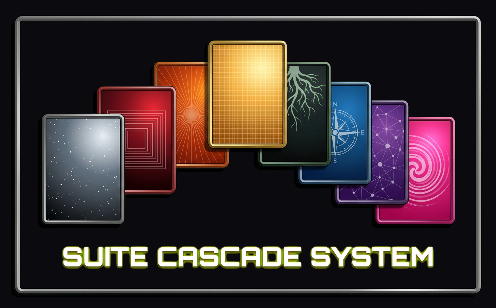

<p align="center">
  
</p>

<p align="center">
  
</p>

<h1 align="center">The Suite Cascade System</h1>

<h3 align="center">ARIOS — Functional Agentic Orchestration</h3>

<p align="center">
  <a href="https://www.npmjs.com/package/scs-bridge">npm</a> · 
  <a href="https://poe.com/SCS-Researcher">Live Demo</a> · 
  <a href="https://phuire-research.github.io/SuiteCascadeSystem/">Static Demo</a> · 
  <a href="https://phuire-research.github.io/SuiteCascadeSystem/muxonomy.html">Muxonomy Proof</a> · 
  <a href="https://github.com/Phuire-Research/Stratimux">Stratimux</a> · 
  <a href="https://github.com/Phuire-Research/IsomorphicExpanse">IsomorphicExpanse</a> · 
  <a href="https://scp-origin.com">SCP-Origin</a> · 
  <a href="Cascades/Documentation/Cascades/ARIOS-POSITION.md">ARIOS Position</a> · 
  <a href="Cascades/Documentation/Cascades/CLAUDE-AI-INSTRUCTIONS.md">Claude.ai Setup</a> · 
  <a href="https://github.com/Phuire-Research/SuiteCascadeSystem/blob/main/LICENSE">GPLv3</a>
</p>

<p align="center">
  <a href="https://www.npmjs.com/package/scs-bridge"></a>
  &nbsp;
  &nbsp;<a href="https://www.npmjs.com/package/scs-bridge"></a>
  &nbsp;
  &nbsp;<a href="https://github.com/Phuire-Research/SuiteCascadeSystem/blob/main/LICENSE"></a>
</p>

---

## Your Frontier, Renewed.

**SCS-Bridge** is a CLI that installs and conducts the **Suite Cascade System** — a renewable
cognitive operating system for your projects — and lands you inside your first **SCP**.

This release is the first public viewing of the SCP: **a self-contained ARIOS** — an
Augmented Renewable Intelligence OS. It self-installs through Claude Code via the SCS-Bridge:
eight complete cognitive cycles that take on any problem as a full development cycle, running
behind your own identity, on your own machine.

The SCS remains the operative aspect throughout — the original introduction is preserved in
full as **[SCS.md](./SCS.md)**.

## The SCP Paradigm

Your SCP is a **Stratimux Concept Program**, a **Suite Cascade Protocol**, and a means of
Containing and Protecting a given domain — by representing it as a **Service that Contains a
Problem**. What makes an SCP is the anomalous frontier that recursively improving software
represents.

Concretely: the SCP is a local Vue + Stratimux window the bridge installed into your
project — the UI representation of the StratiDECK system from Stratimux, a functional
computer system rendered as a window you can build into anything. It's a Deck. A StratiDECK.
Working surfaces — Suite 8s — emerge from your project's domains, each with its own page,
its own working sessions, and its own memory. The running app even rebuilds itself under you
without losing your place.

## The Working Example — the Isomorphic Expanse

The paradigm above is not a diagram — it is running. The
[Isomorphic Expanse](https://github.com/Phuire-Research/IsomorphicExpanse) is the first
released SCP: a world the visitor and its guide build together, and the proof of concept for
**Pass-Through Interaction with Agents** — driving agents from game worlds, play and work on
the same clock.


*The guide is inside the world, and the dialog over its head rides a real Claude Code
session — its voice, its live tool feed, and its permission gate all pass through the game.*

- **Talking to the guide reaches a real session** — replies come back brief and in
  character, while the deep work lands in its terminal.
- **Tool approval surfaces in the dialog** — the agent's real permission gate, answerable
  from inside the world.
- **One turn per step** — the turn you take in the game is the turn the agent takes in the
  work.


*The world itself — built with the same HiFi surfaces, Suite 8 pages, and update circuit
every SCP carries. Everything shown installs from its
[Configuration JSON](https://github.com/Phuire-Research/IsomorphicExpanse) through SCP
Management, the same way any SCP does.*

## Requirements

- **[Claude Code](https://claude.com/claude-code)** installed globally — the one true
  requirement. The bridge conducts real Claude Code sessions; it does not replace them.
- **Node.js + npm** — to install and run the bridge itself.

**A heads-up on Electron**: the bridge's window layer runs on Electron, which installs as a
dependency (a one-time download during `npm i`). Every window you see — the terminal
sessions, the SCP itself — is a local Electron window on your machine. Nothing is served
beyond localhost.

## Installation

```bash
npm i -g scs-bridge
cd your-project
scs
```

The bridge self-installs the Suite Cascade System into the project, then lands you inside
your first SCP: you name it, it installs from the bundled template, boots, and focuses in
front of you. When a freshly minted page needs serving, you press **Turn Over A**: the
bridge rebuilds and re-serves the app under you. That press is your first contact with the
build-while-you-use loop — and from there, what at first Turns, Turns Faster, till it's just
a Cycle.

**Before you install anything:** you are installing software that will run on your
machine. Review what you install — open-source software is provided as is, without warranty
of any kind, and with limited liability. Commit-pinned installs (via an SCP Manifest)
install the specific commit the manifest carries — the same commit the registry stood behind
at verification. The same caution stands on SCP-Origin.

## The MVP — three pillars

### 1 · Session Management

Every Claude Code conversation opens in its own window and resumes exactly where it left
off. One roster holds them all — online and offline sections, filter pills by app and
working surface — and every session can be renamed, archived (recoverable), or dissipated
for good. Each Suite 8 page can hold one **anchored session**: the page and its agent stay
bound, and the anchor is the page's permanent point of return. Sessions run in an isolated
host process — a session-layer fault cannot take the client down; your windows stay, and
the next spawn heals the host.

### 2 · Pass-Through Terminal Usage

The session window is a real terminal running a real Claude Code process — not a replay or
a simulation. Type into it directly; the full terminal interface passes through, wrapped in
the shader render you choose. Messaging from the app's pages honors the same discipline: an
**In Focus** send brings the session forward with your message; a **Pass Through** send
delivers it and leaves you where you are.

### 3 · The Tactical Bridge — Turn Over, for Recursively Improving Applications

Set **Shield A** as your clean baseline, drift on **Sword B**, and turn over from the
bottom dock. The bridge rebuilds and re-serves the app under you — your place survives, and
a bad boot reverts to the baseline within ~45 seconds. Confirming a turn-over with working
changes carries them into B and serves B: you land looking at your own work. This is the
loop the whole system is designed around — an application that improves while you use it,
with a safe way back at every step.

## What else ships

- **The Update circuit** — when the template advances, a retained clone runs a three-way
  comparison against your history and merges without losing your additions; your app's
  identity is preserved by rule.
- **Cascade Memory** — every page founds and maintains its own plan and trajectory
  documents, updating live as its working session writes.
- **The Shatterite Menu** — an agent-authored, staged menu on every Suite 8 page.
- **The Release Door** — set a remote origin and push from the app's own git surface; the
  push of a finished SCP is how it ships.
- **The HiFi system** — render modes, suite colors, patterns, and a component library for
  building your own pages, scoped to each app alone.

The full categorized tour renders in-app: **Home → Release Notes**.

## Updating — two paths

The system updates along two dedicated paths, each owning its own layer:

1. **The SCS itself** — the CLAUDE.md manifold, the `/cascade` commands, and the working
   method update through the Cascade Menu: `/cascade:update` performs a selective merge from
   upstream with a checkpoint first, so your own working memory and local additions survive
   the refresh.
2. **Your SCPs** — each installed app updates through its own dedicated circuit on the GitM
   Update surface: a retained reference clone runs a three-way comparison (the app as
   installed, the app as you've changed it, the template as it is now). Template-only
   changes apply cleanly, your work is preserved untouched, identity fields are preserved by
   rule, and genuine both-sides conflicts are staged for your decision.

The two paths never cross: updating the method never touches your apps, and updating an app
never touches the method.

## Contribute — the Open Race

This is a race run in the open, and right now is the Training Season: the machine you are
using is the first car on the grid, built and proven before it takes the course. The course
runs one racing line after another — the Testing Season (the Reference Design Marketplace),
the Season Opener (the Suite Bulletin System), the Summer Stretch — to a single finishing
line: SCS Dedicated Hardware, the Grand Prix.

**Why contribute**: the whole run is funded in the open. Donations accelerate the current
racing line directly; subscriptions are continued support of the paradigm shift itself.

**What comes back**:

- A subscription grants a **Mozilla Public License 2.0** to the release projects — the
  SCS-Bridge CLI and the pinned SCP configuration — free to use, including in your own
  commercial work.
- Access to a **Shared Router** for contributors, with additional tooling built out on that
  ground to better enable **co-functioning UnSocially** — builds combined, remixed, and
  Reworked on Location, the work speaking with no words required.
- Donations fund the open RoadMap directly and can be directed at the items that matter to
  you — no account required.

**How**: [scp-origin.com/contribute](https://scp-origin.com/contribute) — subscribe or
donate; both move the project forward, neither requires the other. The same door rides
every SCP's Home page as the Open Race section.

## Release Notes — v0.950.2 · The Diametric SCP

### The Achievement

This is a major release, and its title is earned by measure. Three terms carry it, each
plain on first use. A **Demometer** is a different measure — a distinct part with its own
measurable identity. A **Diameter** is a through-measure — a similarity drawn between
unlike parts. A **Muxameter** is the integrated measure — a part as it relays through the
others' Diameters, proven by operation.

The worked example is the Suite 8 page itself. The page is the Demometer — and what makes
two Demometers unlike is the locations of the pages: the same page standing on different
SCPs. The Diameter is the locality — either location can perform from the immediate SCP:
stand Local anor observe and act upon a Specified app, from right where you are. And the
Muxameter forms when you work an S8 page on one SCP and cascade its advances — back into
the Base the page may be formalized from, anor out to the Informatives where you find use
for the page across your projects. The page as it relays, proven by the operation itself.

The foundation of that proof is the SyncLibrary — the locality system. Each Suite 8 page
holds a locality; the Locality Register lays it plain — the Local row and the live ring
rows beside it, each with its status, chosen anor released and re-armed with no reload. A
fire under a Specified locality reaches the target app, never a silent local fire; content
moves under fixed paths while only the library carries the intelligence; and the failure
mode is always preservation of your last local truth, never adoption. On that foundation
stand the teeth: Suite 8 Page Transfer — install a page onto another SCP from the page's
own panel, four stations, Requirements → Target → Gate → Update, proven twice in the
field — and the update from any location, cascading a page's advances into the Base anor
the Informatives, divergence held with both sides quoted for you to decide. Around them, a
page's cascade memory renders live in an observing app within about 100ms of the write,
colors round-trip, textures live in each app's own library, and the Forge Menu stands on
every page — all on the same locality ground.

One notation carries through this piece and the product alike: **anor** — the Gradient
Conjunctive within a Range: And anor Or anor Everything-In-Between. The working example is a
gradient band of Blue and Yellow — and Green is within Blue anor Yellow: the range held
whole rather than a choice forced between its ends.

That is the Total this release proves: not a feature list, but measures that relay. The
counters read it plainly — 0.950.0 · cli 12 · scp 13 · s8 1.

The version number IS the Cascade Cycle: each cycle of the method that builds this software
advances it. The npm badge above always carries the published version.

- **0.950.2 — the Method Seed**: the Home page's Tutorial section becomes the Method
  Seed — the working method this system was built with, shipped as documentation your
  own project can absorb. Browse the Manual, engage the Dialectics, and spawn the
  Cinnabar Dialectic to seed the method into your project's memory; the induction is
  opt-in and performed by the session itself given your set-up, and re-running after an
  update refreshes rather than duplicates. Following through with the installment gives
  the best experience utilizing the SCS. The Cinnabar Dialectic advances to a second
  edition alongside it — its pattern registry doubled into four families — and a
  turn-over can no longer stall silently: if the restart watcher has quietly died, the
  app detects the stall by its own survival and completes the turn-over directly.
- **0.950.1 — a turn-over that knows its name**: a turn-over now belongs to one app by
  name — the name resolves the directory, and only then do the branch operations run
  inside it. The safety deadline remembers which app armed it and stands down only on
  that app's own boot; two apps turning over in the same window no longer collide; and
  each app's restart watcher answers only to signals addressed to it by name. One app's
  turn-over can no longer restart another.
- **0.950.0 — the SyncLibrary: every page holds a locality**: each Suite 8 page holds a
  locality — stand Local anor observe a Specified app, from right where you are. The
  Locality Register lays it plain: the Local row and the live ring rows beside it, each
  with its status — choose anor release a locality and re-arm it with no reload; localities
  are only ever live. A fire under a Specified locality reaches the target app, never a
  silent local fire; content moves under fixed paths while only the library carries the
  intelligence; and failure always preserves your last local truth, never adopts.
  Everything else in this release stands on this ground.
- **0.950.0 — Suite 8 Page Transfer, the Install Circuit**: install a Suite 8 page onto
  another SCP from the page's own panel — four stations, Requirements → Target → Gate →
  Update. A Requirements pass writes the page's needs and concerns into the package
  itself, so they travel with the page; the transfer lands the real page with a report
  written into the receiving app's own working record, and a failed gate restores
  everything honestly. Proven twice in the field.
- **0.950.0 — the update from any location**: work an S8 page wherever you stand, and
  cascade its advances — back into the Base the page was formalized from, anor out to the
  Informatives where you use it across your projects. Divergence never overwrites:
  differences are held with both sides quoted and you decide; the resolved page becomes
  the new Base. The panel names the concrete relation — Base:Name ← Informative:Name —
  and dispatches role-correctly. Field-proven across two live apps.
- **0.950.0 — cascade memory, live across apps**: a page's own working memory — its
  cascade documents — renders in an observing app within about 100ms of the write. No
  reload, honest empty states, and a removal is honestly cleared.
- **0.950.0 — suite colors travel a full circuit**: a color choice completes a round trip
  before it paints — written to the app's own configuration first, then returned to every
  open window at once. And the circuit reaches across apps: from Pewter Tessera, choose
  another app's locality and set its colors — its windows re-tint live, your own styling
  stays untouched.
- **0.950.0 — suite textures become a living library**: the SVG textures behind every pane
  now live in each app's own patternLibrary.json. A new texture is one small JSON entry —
  no code change, no restart — and open pages pick it up live. Rapid changes settle to the
  final value before they land.
- **0.950.0 — the Entourage Forge Menu on every page**: the Forge menu stands as its own
  widget on each Suite 8 page — sessions filtered to that page alone, build actions drawn
  from the page's own documentation, one motion to reach the live Forge. Remove it from any
  page and it stays removed, even through a page update; the Suite 8 panel always keeps the
  full menu within reach, and a freshly authored page opens with it expanded.

- **0.945.0 — every page carries its own version**: a Suite 8 page now holds a version of
  its own, counted apart from the CLI and the app template. When a newer page ships, that
  page's own Suite 8 toolbar button turns amber — a signal that belongs to the page alone;
  the main version badge never turns amber for a page update, and the amber toggle never
  turns the badge red. Two signals, two meanings.
- **0.945.0 — the page update, always within reach**: the Suite 8 Control panel carries a
  standing PAGE #N · NPM #M readout with an update control beside it, always available.
  Matching numbers mean the page is current; a higher NPM number is the invitation to
  refresh a single page when the moment suits you — page by page, never all-at-once.
- **0.945.0 — a page update that honors your design**: a page refresh runs through the
  Entourage Forge with a conference first — where the new page and your version differ, you
  decide; nothing you shaped is overwritten without your say. The same preservation
  discipline the SCP update circuit stands on now guards the single page.
- **0.945.0 — the Forge's Reference Designs, renewed**: two join the Entourage Forge's
  list. Prepared Agent Dispatch prepares any number of agents in sequence, dispatched
  straight from your page, each carrying its own directive. OnBoard.md lets a page ship
  with its own onboarding written alongside it — the page arrives already knowing how to
  introduce itself.
- **0.945.0 — Pewter Tessera joins as a full page**: Pewter Tessera ships as a full Suite 8
  page — pick a locality to preview that SCP's shipped colors in place, held entirely apart
  from your own styling. Nothing you preview ever lands; your look stays yours.
- **0.944.1 — the bridge never hangs on git**: a remote git operation stalling on
  credentials could freeze the whole bridge with it. Git is now told never to prompt
  (it fails fast with its own reason), and a two-minute backstop ends any transport
  that stalls silently — the failure lands in the command log, the bridge stays live.
  CLI-only; SCPs need no changes.
- **0.944.0 — the update flow, reinforced**: concurrent SCP updates share one source
  refresh, every SCP keeps its own update rail, failures name their exact stage, and the
  finalize is one gesture on whichever branch you stand. Two field-earned habits: run an
  update with all your changes committed (the update lands on your current branch), and
  if the Turn Over prompt does not appear after the resolver completes, that is a
  stochastic miss, not a failure — run the update again, or tell the resolver session:
  "Finalize the resolution — write the pending-0 resolution file and fire the Turn Over
  prompt."
- **0.944.0 — your SCPs, curated**: the Installation page carries Installed and Archived
  tabs — archive a finished SCP into a vault beside the working set, restore it intact
  (git and all), or delete it behind a typed-name guard. Worktree SCPs wear their own
  marking and keep both trees whole through the vault; the template itself is
  system-protected.
- **0.944.0 — release notes that know your SCP**: every release rides a versioned
  manifest with an authored magnitude (1-5); the Update page folds it open filtered to
  what YOUR SCP has actually applied — not the version string — so the decision to
  update is informed before it is taken. The same notes render on the Home page as the
  full tour.
- **0.943.0 — updates that explain themselves**: the update diff is now self-describing —
  its provenance block pins the exact preservation rules the merge was computed under
  (identity fields held, never-delete paths), the apply step prefers those pinned rules
  so what computed the update is what lands it even mid-bridge-update, and the resolver
  working inside an SCP reads the guard directly from the artifact.
- **0.942.0 — every SCP holds its own anchor**: the whole session-identity chain is now
  scoped per SCP — spawns carry their SCP's name, anchor claims stay within their SCP,
  a re-engaged session keeps its Suite identity, and a session with nothing to resume
  boots fresh instead of dying. The Session Manager's lanes are named (Spawn General
  Session · the Suite 8 dropdown, reading your SCP's Suite folder live on every open),
  a Session-Manager spawn is a plain instance that never claims a page's anchor, and
  dispatched research workers boot bare with their streamed plan as their directive
  while the page's own anchor keeps its onboarding, primed into motion.

- **0.941.0 — the Forge cycle, completed**: the Entourage Forge engages the moment a page
  is created; the turn-over becomes the trigger at the end of its work, surfacing once
  there is work on the tree and resolving the right branch on its own — a fresh app takes
  its first turn-over with the same overlay and care as the app's very first landing. And
  git actions fired from any page now carry the app's own name to the bridge: a push lands
  on the right repository regardless of session focus.

- **0.940.0 — born from the freshest template**: creating a new app now refreshes the
  template to the latest release before the birth — never a stale vintage — with a one-press
  Create door in SCP Management walking the same staged rail as the manifest install. The
  TUI's create input is honest from the first key. And a render-mode choice now survives
  every internal rewrite: the chromatic shader stands its ground, and closing the CLI
  reliably carries the window set down with it.

- **0.939.0 — the substrate renewed**: Stratimux advances to 0.3.296 across the whole
  manifold — the bridge, the app template, and the flagship apps in one motion, boot-proven
  before shipping. The Open Race rides both faces: the Home page's section and this README's,
  one door to the Commons.

- **0.938.0 — updates that weigh what they carry**: the update circuit now computes from
  the last update you landed rather than from install day: a one-file release reads as a
  one-file update (measured live: 1.6 MB of working papers down to tens of KB), files your
  app already carries identically are invisible to the update, and your own pages and
  suites — the ones the template never shipped — stand beyond question by standing law.

- **0.937.0 — installs that say what happened**: an install the bridge declines now lands
  its honest reason on the staged rail the page already watches — never a silent stall. And
  the Configuration JSON's timestamp is accepted in either UTC spelling (`Z` or `+00:00`),
  on both sides of the door.

- **0.936.0 — the honest red label + the Release pane**: the version label now stays red
  until an update actually lands in your app (not merely when the install finishes) and stays
  purple when a newer publish carries nothing of value for you — the install action stands
  available the whole way. And a first-class Release pane heads the GitM page: set your app's
  remote origin, push (first-push upstream handled), and step into SCP Management to copy its
  Configuration JSON — the manifest others paste to install it.

- **0.935.0 — updates that land whole**: the update conductor is now held to carrying every
  change byte-exact from the comparison itself — anything beyond exact carriage is written as
  the whole resolved file, the always-safe form — so an update either lands complete or stages
  a clear decision, never a stall. And template-only releases now get the same one-press
  install as CLI releases, with the page saying plainly that no relaunch is needed for that
  kind: install, then Run Update.

- **0.934.0 — updates, classed**: every release now declares which aspect it changes — the
  CLI, the app template, or both — and each installation compares on its own. The version
  label beside your app's name turns red when npm carries something newer, its hover names
  the exact path, and clicking it lands the Update page: a one-press CLI update with an
  honest restart notice when the CLI is due, and the whole circuit standing down when only
  the CLI changed.

- **0.933.0 — the update circuit, conducted**: the update surface reads as a sequence — a
  state legend explains every button state in place, the resolver shows a dotted border when
  it is optional (a complete resolution already exists) and appears only after this cycle's
  comparison has run, and a finished update clears its own working artifacts. The resolver's
  session opens with a transparent **Stand By** notice while Claude Code boots, receives its
  instructions on its own, stays focused once they land, and runs with the approval gate
  intact — the update is conducted by you. A rare loop where page navigation after a spawn
  could keep spawning sessions is closed at its root. And the installed bridge version now
  sits beside your app's name on every page — purple when current, red the moment npm
  carries a newer publish, fuchsia when your install is ahead; hover it for both versions
  and the verdict.
- **0.931.0 — the complete system ships**: the update circuit's tooling, the cascade
  commands, the Suite 8 instances, the documentation, and the assets all ride the package.

Highlights from 0.930.0:

- **Crash containment** — terminal sessions in their own host process; recovery is honest
  even across stale locks and reused process ids.
- **The Frame Governor** — the shader draws at 24 FPS by default, the cadence of animation
  film, with a live Settings slider from 8 to 60.
- **The Documentation Site** — Base, Local, and Cascade shelves, read fresh from disk.
- **Per-app styling** — color and pattern choices never bleed between installs.
- **The Release Door** — remote origin management and push, first-push upstream handled.
- **Claude Opus 5 as the default model** — with the full current lineup selectable per
  instance.
- **Focus discipline** — windows come forward only when asked; navigation never steals
  your attention.

## One bridge at a time

This release runs a single SCS-Bridge per machine. A second bridge in another project
detects the running one, names its workspace, and stands down with plain instructions. A
crashed bridge is detected stale and claimed over automatically.

### Tutorial — locked, unlocking

An interactive, step-conducted tutorial (the install experience turned teacher) ships in a
future release. It mirrors a curated walkthrough series at
**[youtube.com/@Phuire](https://www.youtube.com/@Phuire)** — the channel is the walkthrough's
home and unlocks first.

## Debug Logging

```bash
scs --debug            # pipe trace events to ./Cascades/Bridge/debug.log
tail -f Cascades/Bridge/debug.log
```

## Development

```bash
npm install
npm run build          # dist/cli.cjs
npm run typecheck
npm test
```

## License

GPL-3.0 — see [LICENSE](./LICENSE)
